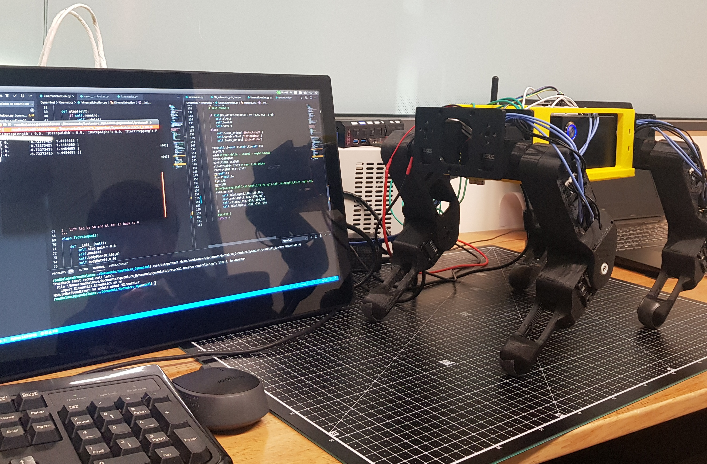
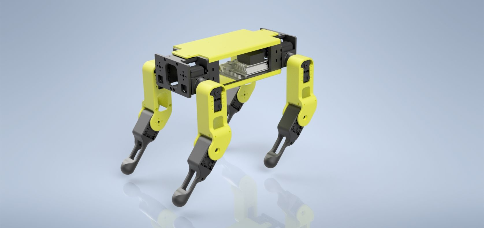

# Spotmicro_Dynamixel

Quadruped Robot with [Robotis Dynamixel](https://www.robotis.us/dynamixel/) and our log for Full tutorial.


<p align="center">
    
    
</p>

## Folder Explanation

```
├─BNO_055
├─Common
├─Dynamixel
├─Images
├─Kinematics
├─Parts
├─Simulation
└─Spotmicro
    └─SD_automatic_gait_test.py
```

* `BNO_055` : Adafruit IMU Sensor test
* `Dynamixel` : Codes for Robotis Dynamixel, Motor Protocol with Python API included. ([AX-12a](https://emanual.robotis.com/docs/en/dxl/ax/ax-12a/) used in this project)
* `Kinematics` : Codes for how to explain Quadruped robot into Python code. Basic Forward/Backward Kinematics implemented
* `Parts` : Modeling Files for 3D printer.

## Modeling Parts printing

<p align="center">
    
</p>

All modeling files located in **Parts** folder.
And there's also [assembly description written in notion](https://www.notion.so/Hardware-00238903ad6c4186bfc3acba8eadde08)

### Common
Keyboard operation

### 
Dynamixel motor repository
```
Dynamixel_sdk
protocol1_0
protocol2_0
```

### Spotmicro
Real robot Usage

```
SD_servo_controller_test.py
SD_automatic_gait_test.py
```

> SD_servo_controller_test.py
* Operate respective Dynamixel motor 

> SD_automatic_gait_test.py
* Make the robot walk using keyboard 

## 


---

## Reference && Community

This repository originally forked from [FlorianWilk's Jetson Nano SpotMicro Project](https://github.com/FlorianWilk/SpotMicroAI)

COMPLETE DOCUMENTATION AND GETTING STARTED GUIDES CAN BE FOUND AT:
[https://spotmicroai.readthedocs.io/en/latest/](https://spotmicroai.readthedocs.io/en/latest/)

[spotmicroai.readthedocs.io](http://spotmicroai.readthedocs.io)

The best place to get started is to read the getting started documentation at [spotmicroai.readthedocs.io](spotmicroai.readthedocs.io). The documentation will eventually contain a complete tutorial for building a SpotMicroAI including where to source components, links to most recent 3D files for printing, assembly, and installing the software. It's being updated as we go.

For questions or more information please see the [Forums at SpotMicroAI.org](http://SpotMicroAI.org), or asked on slack. Join our slack at: [https://spotmicroai-inviter.herokuapp.com/](https://spotmicroai-inviter.herokuapp.com/)


BostonDynamics Spot robot: https://www.youtube.com/watch?v=wlkCQXHEgjA

Can you make it dance? join the challenge: https://www.youtube.com/watch?v=kHBcVlqpvZ8&list=PLp5v7U2tXHs3BYfe93GZwuUZLGsisapic&index=2

Original idea by KDY0523 https://www.thingiverse.com/thing:3445283

Some of the community videos: https://www.youtube.com/playlist?list=PLp5v7U2tXHs3BYfe93GZwuUZLGsisapic

* Join us in Slack: https://spotmicroai-inviter.herokuapp.com/
* Documentation: https://spotmicroai.readthedocs.io
* Forum http://spotmicroai.org/

This is the repository for simulation code, usually in combination with nVIDIA Jetson Nano board, of SpotMicro project.

In here you can find all the project repositories: **https://gitlab.com/custom_robots/spotmicro**

### Community:
The primary community discussions take place on SpotMicro.org. The message boards there contain a repository of topics which span hardware and software.

Real-time question-and-answer (or as close to real time as is possible when run by volunteers with full-time jobs and families) can happen on slack (LINK coming soon).

Other questions occasionally surface on other location such as on Thingiverse or on robotshop.com. We do our best answers these as we see them, but if you want to be heard the best way is either on SpotMicro.org or on slack.

As a community we do have some small expenses such as web hosting fees and occasional developing fees. In the future, we would also like to hold events and competitions. To anyone who finds enjoyment or education in this project we appreciate the financial support you're able to give. Donations coming soon.

All donations stay in the community and go towards future development.

If you use this worker will any work derived from it in academic publication please cite it as: *insert citation here*.


